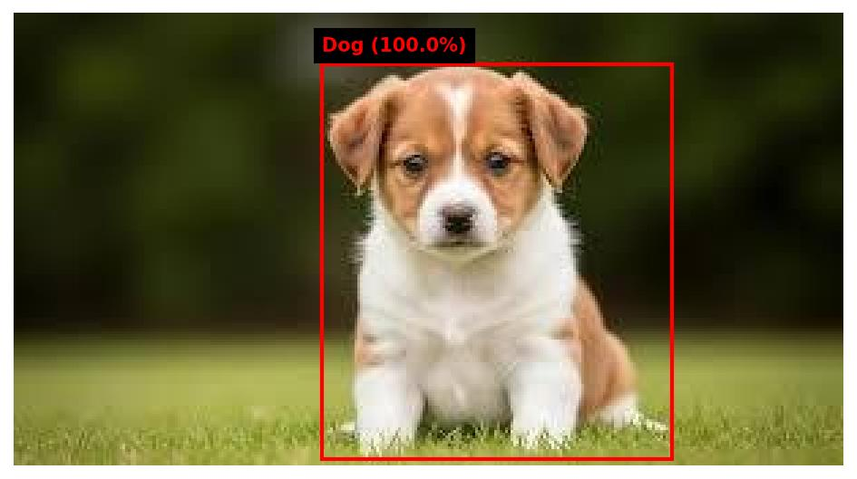

# 👁️ Image Labels Generator

A cloud-native computer vision pipeline that automatically processes images, detects multi-class objects, and dynamically renders spatial bounding boxes using deep learning.

[](https://aws.amazon.com/)
[](https://www.python.org/)
[](https://opensource.org/licenses/MIT)

---

## ⚡ Overview

This project leverages AWS deep learning models to perform automated object detection and spatial analysis on uploaded images. By coupling cloud storage with serverless vision APIs, it extracts high-confidence labels and maps bounding box coordinates natively onto local image renders.

### 🎯 Key Use Cases
* **Smart Surveillance:** Automated anomaly and object detection in real-time streams.
* **Retail Inventory:** Automated item counting and category tagging for digital shelves.
* **Accessibility Tech:** Generating descriptive spatial metadata for visually impaired users.

---

## 🏗️ Architecture & Workflow
# Image Labels Generator

A computer vision project that automatically detects objects in images and draws bounding boxes with confidence scores — powered by **AWS Rekognition** and **Python**.



---

## What It Does

Upload any image and the script will:
- Detect all objects in the image using AWS deep learning AI
- Label each object with its name and confidence percentage
- Draw colored bounding boxes around every detected object
- Save the annotated image to the `output/` folder

---

## Tech Stack

| Tool | Purpose |
|---|---|
| Python 3 | Main programming language |
| AWS S3 | Cloud storage for uploaded images |
| AWS Rekognition | AI image analysis (object detection) |
| boto3 | Python library to talk to AWS |
| matplotlib | Drawing bounding boxes on images |
| Pillow | Reading and processing image files |

---

## Project Structure

```
Image Labels Generator/
├── images/              ← Put your input images here
├── output/              ← Annotated images saved here (auto-created)
├── screenshots/         ← Demo images for this README
├── detect_labels.py     ← Main script
└── requirements.txt     ← Python dependencies
```

---

## Setup & Installation

### 1. Prerequisites
- Python 3.8+
- An AWS account (free tier is enough)
- AWS CLI installed and configured

### 2. Clone the repository
```bash
git clone https://github.com/YOUR-USERNAME/image-labels-generator.git
cd image-labels-generator
```

### 3. Create and activate virtual environment
```bash
# Windows
python -m venv venv
.\venv\Scripts\Activate.ps1

# Mac/Linux
python -m venv venv
source venv/bin/activate
```

### 4. Install dependencies
```bash
pip install -r requirements.txt
```

### 5. Configure AWS credentials
```bash
aws configure
# Enter your Access Key ID, Secret Access Key, region (us-east-1), output (json)
```

### 6. Create an S3 bucket
Go to AWS Console → S3 → Create bucket. Note your bucket name.

### 7. Update bucket name in the script
Open `detect_labels.py` and update line 10:
```python
BUCKET_NAME = "your-bucket-name-here"
```

---

## Usage

Add any `.jpg` image to the `images/` folder, then run:

```bash
python detect_labels.py images/sample.jpg
```

**Example output:**
```
Uploading sample.jpg to S3...
Upload complete.
Analyzing image with Rekognition...

Detected 7 labels:
  - Dog (100.0%)
  - Animal (100.0%)
  - Mammal (100.0%)
  - Pet (100.0%)
  - Puppy (100.0%)
  - Hound (80.8%)
Output saved to: output\labeled_sample.jpg
```

Open the result:
```bash
# Windows
start output\labeled_sample.jpg
```

---

## How It Works

```
Your Image → Upload to S3 → Rekognition API → Parse Labels → Draw Boxes → Save Output
```

1. **Upload** — Image is uploaded to your S3 bucket
2. **Detect** — Rekognition analyzes the image and returns detected labels with bounding box coordinates
3. **Draw** — matplotlib draws colored rectangles around each object using the coordinates
4. **Save** — Annotated image is saved to `output/`

---

## AWS Free Tier

This project runs entirely within the AWS Free Tier:

| Service | Free Allowance |
|---|---|
| Amazon S3 | 5 GB storage, 20k GET requests/month |
| Amazon Rekognition | 5,000 images/month (first 12 months) |

---

## Use Cases

- Smart surveillance and security systems
- Automated retail inventory management
- Accessibility tools for visually impaired users
- Automatic photo organization and tagging
- Content moderation for user-uploaded images
